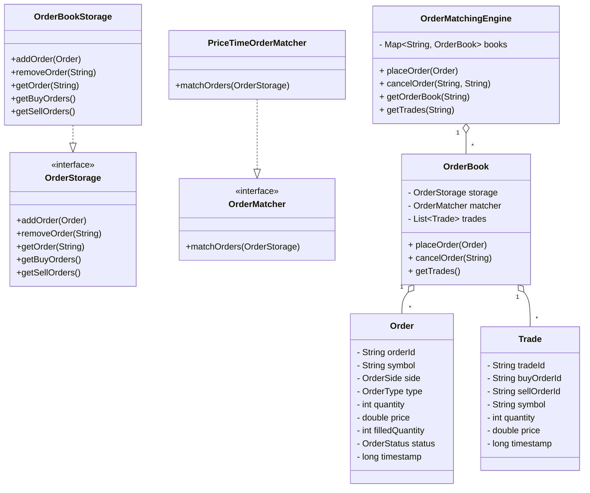

# Problem: Design a stock trading app order matching engine

## Source
- Platform: Salesforce LLD prep
- Topic: Trading / Order Matching
- Tags: Design, LowLevelDesign, Trading, OrderBook
- Difficulty: Medium
- Revision Status: New
- Tier: Tier 2

## Problem Cue
Design a simplified stock trading application that supports order placement and matching for buy and sell orders.

## Brief Problem Statement
Build a class-level design for a stock trading app focused on order placement, order book management, and trade matching. The design should capture how limit and market orders are accepted, matched, partially filled, and cancelled.

## Recognition Pattern
- Domain signal: Trading, order book, exchange
- Focus: order placement + matching engine, not account onboarding or portfolio analytics
- Use this note when asked to design a market/order matching flow in an LLD interview

## Core Insight
Maintain two price-priority order books per stock symbol, with a buy-side max-heap and a sell-side min-heap, and keep a lookup map for fast cancel/update operations.

## Solution Approach
1. Identify the core domain entities: `Order`, `OrderBook`, `Trade`, and `OrderMatchingEngine`.
2. Choose the right order storage strategy:
   - buy orders sorted by highest price and earliest timestamp
   - sell orders sorted by lowest price and earliest timestamp
3. Use a shared order map for cancel and state lookup.
4. Implement matching logic that repeatedly pairs top buy and sell orders while prices overlap.
5. Handle market orders by matching against the best available opposite-side orders.
6. Track order state transitions: `NEW` -> `PARTIALLY_FILLED` -> `FILLED` / `CANCELLED`.

## Class Design
- `Order`
  - Attributes: orderId, symbol, side, type, quantity, price, filledQuantity, status, timestamp
  - Responsibility: represent the order request and current fill state.
  - Key methods:
    - `remainingQuantity()`: computes open quantity still available for execution.
    - `isFilled()`: checks whether the order is completely executed.
    - `applyFill(int executedQuantity)`: updates filled quantity and moves status to `PARTIALLY_FILLED` or `FILLED`.
    - `cancel()`: moves an unfilled order to `CANCELLED`.

- `Trade`
  - Attributes: tradeId, buyOrderId, sellOrderId, symbol, quantity, price, timestamp
  - Responsibility: capture a matched execution between a buy and sell order.

- `OrderStorage`
  - Responsibility: abstract how active orders are stored and retrieved.
  - Methods: `addOrder`, `removeOrder`, `getOrder`, `getBuyOrders`, `getSellOrders`.
  - Reasoning: matching logic should not need to know the exact storage implementation.

- `OrderMatcher`
  - Responsibility: abstract the matching algorithm.
  - Method: `matchOrders`.
  - Reasoning: keeps the matching strategy replaceable. For example, price-time matching can later be replaced or extended without rewriting `OrderBook`.

- `OrderBookStorage`
  - Buy queue: max-heap ordering by price descending, timestamp ascending
  - Sell queue: min-heap ordering by price ascending, timestamp ascending
  - Order lookup map: `orderId` -> `Order`
  - Responsibility: maintain the active orders for one symbol.

- `PriceTimeOrderMatcher`
  - Responsibility: repeatedly match the best buy and best sell while matching conditions hold.
  - Methods: `matchOrders`, `canMatch`, `determineExecutionPrice`, `createTrade`.
  - Reasoning: price-time priority is the standard matching rule for a simplified exchange.

- `OrderBook`
  - Attributes: symbol, storage, matcher, trades, lock
  - Responsibility: own all mutable state for one stock symbol.
  - Methods: `placeOrder`, `cancelOrder`, `getTrades`.

- `OrderMatchingEngine`
  - Maintains a concurrent map of symbol -> `OrderBook`
  - Coordinates placement of orders, cancellation, and order book routing
  - Methods: `getOrCreateBook`, `placeOrder`, `cancelOrder`, `getTrades`.

## Design Reasoning
- `Order` keeps order state transitions close to the data they modify. This avoids spreading fill and cancellation logic across the matcher and storage classes.
- `Trade` is modeled separately because it is an execution record, not an active order. Once created, it should be treated as immutable history.
- `OrderStorage` exists so the matcher depends on behavior rather than a concrete class. This makes the storage strategy swappable.
- `OrderMatcher` exists so the order book does not hard-code a matching algorithm. `PriceTimeOrderMatcher` is one implementation of that strategy.
- `OrderBookStorage` owns the buy queue, sell queue, and order lookup map because these structures must stay consistent with each other.
- `OrderBook` is the aggregate/root object for one symbol. It coordinates storage, matching, cancellation, and trade history.
- `OrderMatchingEngine` is only a router across symbols. It should not directly manipulate queues or matching rules.

## Thread Safety Reasoning
- The critical mutable state for a symbol lives inside `OrderBook`: active orders, fills, queue removals, and trade history.
- `OrderBook.placeOrder` uses a lock because placing an order is a multi-step operation:
  - add order to storage
  - match against opposite-side orders
  - update order fill state
  - remove filled orders
  - append generated trades
- These steps must be atomic for the same symbol. Two threads matching the same book at the same time could otherwise peek, fill, or remove the same orders incorrectly.
- `OrderBook.cancelOrder` uses the same lock because cancellation mutates the order map, queue, and order status.
- `OrderBook.getTrades` uses the same lock because `trades` is an `ArrayList`. It returns a defensive copy so callers cannot mutate internal trade history.
- `OrderMatchingEngine` uses `ConcurrentHashMap` for the `books` map. This makes `computeIfAbsent` safe when multiple threads try to create or fetch the same symbol book.
- Locking is intentionally per `OrderBook`, not global across the whole engine. This allows independent symbols to trade concurrently:
  - two `AAPL` orders serialize on the `AAPL` book lock
  - one `AAPL` order and one `MSFT` order can proceed independently
- The rule of thumb: put the lock where the related mutable state is owned. The engine owns the symbol map, so it uses a concurrent map. Each order book owns matching state, so it uses a per-book lock.

## Key Data Structures
- `PriorityBlockingQueue<Order>` for buy and sell sides
- `ConcurrentHashMap<String, Order>` for fast order lookup
- `ConcurrentMap<String, OrderBook>` for per-symbol books
- `ReentrantLock` in each `OrderBook` to serialize multi-step matching and cancellation for one symbol

## Matching Flow
1. Receive a new order from the client.
2. Route it to the symbol-specific order book.
3. If it is a market order, compare against the best available opposite side until filled or book exhausts.
4. If it is a limit order, match while price conditions allow, then keep any remainder as resting order.
5. Generate `Trade` objects for every partial execution.
6. Update order states and remove fully filled orders from the book.

## Simplified State Transitions
- `NEW` -> `PARTIALLY_FILLED` when some quantity executes
- `NEW` or `PARTIALLY_FILLED` -> `FILLED` when filledQuantity == quantity
- `NEW` or `PARTIALLY_FILLED` -> `CANCELLED` if cancelled before full execution

## Edge Cases / Traps
- Market orders with no opposite side liquidity should be rejected or queued according to requirements.
- Partial fills should update both order state and remaining quantity.
- Cancel requests must handle orders not in the book or already filled.
- Duplicate order IDs should be rejected.
- Price-time priority must be preserved exactly for matching fairness.

## Interview Thought Process
- Clarify product scope: only order matching, no user account ledger required.
- Confirm accepted order types: limit and market.
- Ask whether IOC / FOK or order modifiers are needed; if not, keep design simple.
- Explain why heaps are a good fit for top-of-book matching.
- Describe how a real system would shard by symbol and use a distributed matching engine for scale.

## Optional Code Sketch
See `lld-problems/StockTradingAppExample.java` for a minimal implementation of the order book and matching engine.

## UML Class Diagram

