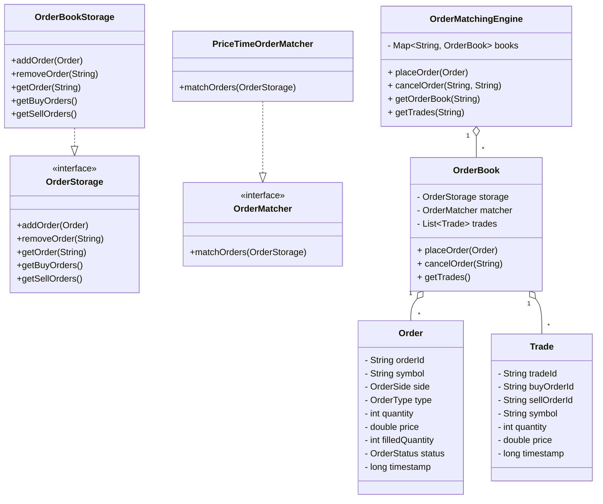

# Problem: Design a stock trading app order matching engine

## Source
- Platform: Salesforce LLD prep
- Topic: Trading / Order Matching
- Tags: Design, LowLevelDesign, Trading, OrderBook
- Difficulty: Medium
- Revision Status: New
- Tier: Tier 2

## Problem Cue
Design a simplified stock trading application that supports order placement and matching for buy and sell orders.

## Brief Problem Statement
Build a class-level design for a stock trading app focused on order placement, order book management, and trade matching. The design should capture how limit and market orders are accepted, matched, partially filled, and cancelled.

## Recognition Pattern
- Domain signal: Trading, order book, exchange
- Focus: order placement + matching engine, not account onboarding or portfolio analytics
- Use this note when asked to design a market/order matching flow in an LLD interview

## Core Insight
Maintain two price-priority order books per stock symbol, with a buy-side max-heap and a sell-side min-heap, and keep a lookup map for fast cancel/update operations.

## Solution Approach
1. Identify the core domain entities: `Order`, `OrderBook`, `Trade`, and `OrderMatchingEngine`.
2. Choose the right order storage strategy:
   - buy orders sorted by highest price and earliest timestamp
   - sell orders sorted by lowest price and earliest timestamp
3. Use a shared order map for cancel and state lookup.
4. Implement matching logic that repeatedly pairs top buy and sell orders while prices overlap.
5. Handle market orders by matching against the best available opposite-side orders.
6. Track order state transitions: `NEW` -> `PARTIALLY_FILLED` -> `FILLED` / `CANCELLED`.

## Class Design
- `Order`
  - Attributes: orderId, symbol, side, type, quantity, price, filledQuantity, status, timestamp
  - Responsibility: represent the order request and current fill state.

- `Trade`
  - Attributes: tradeId, buyOrderId, sellOrderId, symbol, quantity, price, timestamp
  - Responsibility: capture a matched execution between a buy and sell order.

- `OrderBook`
  - Buy queue: max-heap ordering by price descending, timestamp ascending
  - Sell queue: min-heap ordering by price ascending, timestamp ascending
  - Order lookup map: `orderId` -> `Order`
  - Methods: `placeOrder`, `cancelOrder`, `matchOrders`, `getTopOfBook`.

- `OrderMatchingEngine`
  - Maintains a map of symbol -> `OrderBook`
  - Coordinates placement of orders, cancellation, and order book routing
  - Methods: `placeOrder`, `cancelOrder`, `getOrderBook`, `createTrade`.

## Key Data Structures
- `PriorityQueue<Order>` for buy and sell sides
- `HashMap<String, Order>` for fast order lookup
- `Map<String, OrderBook>` for per-symbol books

## Matching Flow
1. Receive a new order from the client.
2. Route it to the symbol-specific order book.
3. If it is a market order, compare against the best available opposite side until filled or book exhausts.
4. If it is a limit order, match while price conditions allow, then keep any remainder as resting order.
5. Generate `Trade` objects for every partial execution.
6. Update order states and remove fully filled orders from the book.

## Simplified State Transitions
- `NEW` -> `PARTIALLY_FILLED` when some quantity executes
- `NEW` or `PARTIALLY_FILLED` -> `FILLED` when filledQuantity == quantity
- `NEW` or `PARTIALLY_FILLED` -> `CANCELLED` if cancelled before full execution

## Edge Cases / Traps
- Market orders with no opposite side liquidity should be rejected or queued according to requirements.
- Partial fills should update both order state and remaining quantity.
- Cancel requests must handle orders not in the book or already filled.
- Duplicate order IDs should be rejected.
- Price-time priority must be preserved exactly for matching fairness.

## Interview Thought Process
- Clarify product scope: only order matching, no user account ledger required.
- Confirm accepted order types: limit and market.
- Ask whether IOC / FOK or order modifiers are needed; if not, keep design simple.
- Explain why heaps are a good fit for top-of-book matching.
- Describe how a real system would shard by symbol and use a distributed matching engine for scale.

## Optional Code Sketch
See `lld-problems/StockTradingAppExample.java` for a minimal implementation of the order book and matching engine.

## UML Class Diagram

